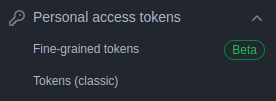
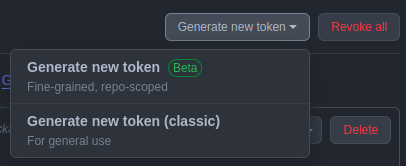
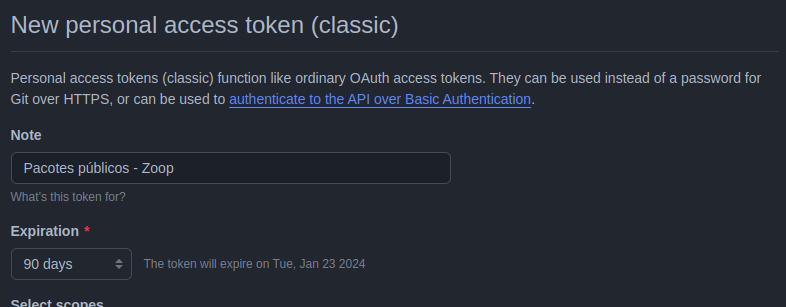
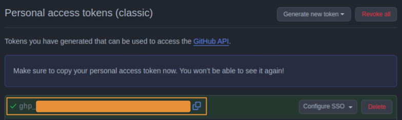

# zoop-package-public

Repositório publico Zoop para clientes terem acesso a produtos com facilidade


<table border="1px">
  <tr>
    <td>
        <h4>Índice</h4>
        <ol type="1">
            <li>
                <a href="#gradle">Gradle</a>
                <ol type="i">
                    <li><a href="#adicionando-o-repositório-maven">Adicionando o repositório maven</a></li>
                </ol>
            </li>
            <li>
                <a href="#gerando-uma-github-pat">Gerando uma GitHub PAT</a>
                <ol type="i">
                    <li><a href="#gerando-uma-pat-fined-grained">Gerando uma PAT <i>fined-grained</i></a></li>
                    <li><a href="#gerando-uma-pat-classic">Gerando uma PAT <i>classic</i></a></li>
                    <li><a href="#cuidados-sobre-a-exposição-da-pat">Cuidados sobre a exposição da PAT</a></li>
                </ol>
            </li>
        </ol>
    </td>
  </tr>
</table>

## Gradle

O acesso ao repositório _maven_ da Zoop requer autenticação, como todo repositório _maven_ do GitHub. Por isso, é necessário usar suas credenciais do GitHub no projeto para obter quaisquer pacotes. Especificamente, você precisa de seu **usuário** e de uma **_personal access token_ (PAT)** que possua permissão para ler e obter pacotes/artefatos de repositórios públicos.

<table border="1px" width="100%">
  <tr>
    <td>
<h4>"Como eu obtenho ou gero uma GitHub PAT?"</h4>
<p>Se você ainda não usou as PATs do GitHub, ou se não sabe ao certo que permissões conceder à PAT, não se preocupe. Veja o passo-a-passo abaixo, em <a href="#gerando-uma-github-pat">Gerando uma GitHub PAT</a>, para esclarecer essas dúvidas. Ou consulte a documentação do GitHub.</p>
    </td>
  </tr>
</table>

### Adicionando o repositório maven

Adicione o repositório _maven_ da Zoop ao seu arquivo `build.gradle[.kts]` ou similar, como no código abaixo.

```kt
// Em Kotlin.

maven {
    url = uri("https://maven.pkg.github.com/getzoop/zoop-package-public")

    credentials {
        username = "${seu-usuário-GitHub}"
        password = "${sua-PAT-GitHub}"
    }
}
```

#### Exemplo completo

```kt
repositories {
    google()
    mavenCentral()
    maven {
        url = uri("https://maven.pkg.github.com/getzoop/zoop-package-public")

        credentials {
            username = "MyCompanyGH"
            password = "github_pat_..."
        }
    }
}
```

## Gerando uma GitHub PAT

O GitHub oferece dois modelos de PAT: **_classic_** e **_fine-grained_**. Ambos os modelos possibilitam limitar as permissões concedidas à PAT. Contudo, o modelo _fine-grained_ tem um grau de flexibilidade muito maior, com a opção de especificar permissões por repositório — além da PAT não ser excluída com sua revogação automática. Já o _classic_ não oferece a opção de refinar as permissões por repositório, e a PAT é excluída ao ser revogada automaticamente.

Recomendamos que uma PAT do modelo **_fine-grained_** seja usada para o propósito de autenticação no acesso ao repositório de pacotes _maven_. Mas, caso você não possa fazê-lo, ainda tem a opção de usar uma PAT do modelo _classic_.

### Gerando uma PAT _fined-grained_

Acesse as [configurações](https://github.com/settings) de sua conta no GitHub e clique em _Developer settings_.


Em seguida, clique em [_Personal access tokens > Fine-grained tokens_](https://github.com/settings/tokens?type=beta).


Clique no botão <kbd>[Generate new token](https://github.com/settings/personal-access-tokens/new)</kbd>.


Preencha o campo _Token name_ com um nome e o campo _Description_ com uma descrição que ajudem você a identificar o propósito desta nova PAT mais tarde. Determine o período de expiração da nova PAT em _Expiration_. Embora seja tentador a configurar para que não expire, recomendamos não fazê-lo. Se a PAT vier a tornar-se obsoleta e esquecida, por qualquer motivo, pelo menos ela será revogada automaticamente, mitigando transtornos.


Em _Repository access_, marque a opção _Public Repositories (read-only)_.


Você também pode marcar _All repositories_, ao invés disso. Porém, será necessário conceder permissões adicionais. Nesse caso, em _Permissions > Repository permissions > Actions_, selecione a opção _Read-only_.


Clique no botão <kbd>Generate token</kbd> para finalizar o processo. Copie agora a chave apresentada e armazene-a. É essa a chave que será usada nas credenciais de acesso ao repositório _maven_ da Zoop.


### Gerando uma PAT _classic_

Acesse as [configurações](https://github.com/settings) de sua conta no GitHub e clique em _Developer settings_.


Em seguida, clique em [_Personal access tokens > Tokens (classic)_](https://github.com/settings/tokens).



Clique no botão <kbd>Generate new token</kbd> e selecione a opção [_Generate new token (classic)_](https://github.com/settings/tokens/new).



Preencha o campo _Note_ com um nome ou descrição que ajude você a identificar o propósito desta nova PAT mais tarde. Determine o período de expiração da nova PAT em _Expiration_. Embora seja tentador a configurar para que não expire, recomendamos não fazê-lo. Se a PAT vier a tornar-se obsoleta e esquecida, por qualquer motivo, pelo menos ela será revogada automaticamente, mitigando transtornos.



Dentre os escopos (_Select scopes_) oferecidos, marque no mínimo `read:packages`. Lembre-se de que você pode editar os escopos concedidos a uma PAT _classic_ mais tarde.


Clique no botão <kbd>Generate token</kbd> para finalizar o processo. Copie agora a chave apresentada e armazene-a. É essa a chave que será usada nas credenciais de acesso ao repositório _maven_ da Zoop.



### Cuidados sobre a exposição da PAT

O GitHub dispõe de mecanismos de segurança que monitoram os repositórios em busca de vazamentos de credenciais, incluindo as PATs de seus usuários. Caso uma PAT seja detectada dentro de um repositório público, o GitHub poderá **revogá-la** automaticamente, expirando-a, se for _fine-grained_, ou excluindo-a, se for _classic_. Portanto, atente-se quanto à exposição de suas PATs para que não sejam revogadas.
