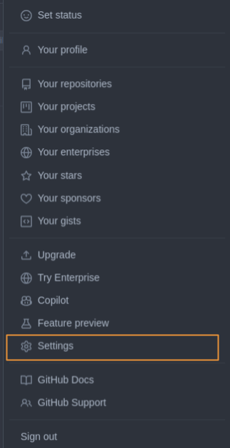
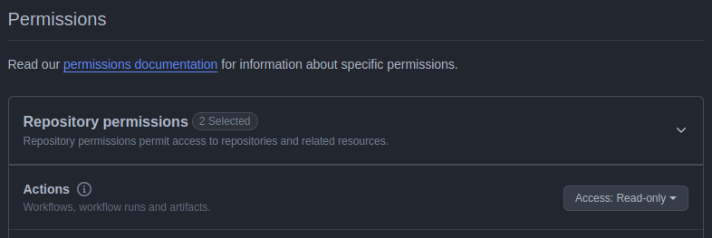

# zoop-package-public

Repositório publico Zoop para clientes terem acesso a produtos com facilidade

<table border="1px">
  <tr>
    <td>
        <h4>Índice</h4>
        <ol type="1">
            <li>
                <a href="#gradle">Gradle</a>
                <ol type="i">
                    <li><a href="#adicionando-o-repositório-maven">Adicionando o repositório maven</a></li>
                </ol>
            </li>
            <li>
                <a href="#swift-package-manager">Swift Package Manager</a>
                <ol type="i">
                    <li><a href="#pré-requisitos">Pré-requisitos</a></li>
                    <li><a href="#passo-a-passo">Passo a passo</a></li>
                </ol>
            </li>
            <li>
                <a href="#cocoapods">CocoaPods</a>
            </li>
            <li>
                <a href="#gerando-uma-github-pat">Gerando uma GitHub PAT</a>
                <ol type="i">
                    <li><a href="#cuidados-sobre-a-exposição-da-pat">Cuidados sobre a exposição da PAT</a></li>
                </ol>
            </li>
        </ol>
    </td>
  </tr>
</table>

## Gradle

O acesso ao repositório _maven_ da Zoop requer autenticação, como todo repositório _maven_ do GitHub. Por isso, é necessário usar suas credenciais do GitHub no projeto para obter quaisquer pacotes. Especificamente, você precisa de seu **usuário** e de uma **_personal access token_ (PAT)** que possua permissão para ler e obter pacotes/artefatos de repositórios públicos.

<table border="1px" width="100%">
  <tr>
    <td>
<h4>"Como eu obtenho ou gero uma GitHub PAT?"</h4>
<p>Se você ainda não usou as PATs do GitHub, ou se não sabe ao certo que permissões conceder à PAT, não se preocupe. Veja o passo-a-passo abaixo, em <a href="#gerando-uma-github-pat">Gerando uma GitHub PAT</a>, para esclarecer essas dúvidas. Ou consulte a documentação do GitHub.</p>
    </td>
  </tr>
</table>

### Adicionando o repositório maven

Adicione o repositório _maven_ da Zoop ao seu arquivo `build.gradle[.kts]` ou similar, como no código abaixo.

```kt
// Em Kotlin.

maven {
    url = uri("https://maven.pkg.github.com/getzoop/zoop-package-public")

    credentials {
        username = "${seu-usuário-GitHub}"
        password = "${sua-PAT-GitHub}"
    }
}
```

#### Exemplo completo

```kt
repositories {
    google()
    mavenCentral()
    maven {
        url = uri("https://maven.pkg.github.com/getzoop/zoop-package-public")

        credentials {
            username = "MyCompanyGH"
            password = "github_pat_..."
        }
    }
}
```

## Swift Package Manager

### Pré-requisitos

- **Xcode** instalado (versão compatível com Swift Package Manager).
- Acesso ao repositório do pacote no **GitHub**.
- Um **Personal Access Token (PAT)** do GitHub (se necessário para repositórios privados).

### Passo a passo

1. Abrir o Projeto no Xcode: Abra o projeto no qual deseja adicionar o pacote utilizando o **Xcode**.
2. Acessar as Dependências do Projeto:
    1. No **navegador de projeto**, clique no nome do seu projeto.
    2. Selecione a aba **Package Dependencies**.
3. Configurar Conta GitHub no Xcode (Se Necessário):
    1. Clique no botão **+** para adicionar uma conta.
    2. Escolha **GitHub** e insira suas credenciais.
    3. Caso seja necessário um **PAT**, gere um no GitHub e insira no Xcode.
4. Adicionar o Repositório do Pacote:
    1. Copie a URL do repositório do pacote.
    2. No Xcode, clique em **+** para adicionar um pacote.
    3. Cole a URL copiada no campo de pesquisa e clique em **Adicionar Pacote**.
5. Definir a Regra de Dependência:
    1. Escolha uma versão estável ou uma branch específica.
    2. Ajuste a opção **Dependency Rule** conforme necessário (`Up to Next Major Version` ou uma branch específica).
6. Confirmar a Adição do Pacote: Após a configuração, o pacote será baixado e adicionado ao projeto. Confirme que ele aparece na lista de dependências.
7. Validar a Integração: 
    1. Verifique se o pacote está listado em **Package Dependencies**.
    2. Teste a importação no código:
```swift
import NomeDoPacote

// Exemplo básico de uso
NomeDoPacote.algo()
```

## CocoaPods


1. Configurar o arquivo `Podfile`
    1. No diretório raiz do seu projeto, abra (ou crie) um arquivo chamado `Podfile`.
    2. Adicione a seguinte configuração para incluir o pacote via CocoaPods, especificando o repositório Git e a branch escolhida:
```ruby
platform :ios, '11.0'

target 'SeuProjeto' do
  use_frameworks!

  # Adicionando o TapOnPhoneSDK via CocoaPods
  pod 'NomeDoPacote', :git => 'https://github.com/getzoop/zoop-package-public.git', :branch => 'NomeDoPacote/Versão'
end
``` 

> **Nota:** Substitua `'SeuProjeto'` pelo nome do seu *target* no Xcode, `'NomeDoPacote'` pelo nome do Pacote desejado e `'Versão'` pela versão desse pacote.

2. Instalar as dependências
    1. No terminal, navegue até o diretório do seu projeto.
    2. Execute o comando e aguarde a instalação das dependências. O CocoaPods irá clonar o repositório especificado e integrar o SDK ao seu projeto.
```bash
pod install
```
> **Dica:** Caso encontre erros, certifique-se de que o CocoaPods está atualizado executando:  
> ```bash
> sudo gem install cocoapods
> ``` 

3. Abrir o projeto com o arquivo `.xcworkspace`: Depois que a instalação for concluída, abra o arquivo `.xcworkspace` gerado pelo CocoaPods para trabalhar com o SDK:
```bash
open SeuProjeto.xcworkspace
``` 
4. Validar a integração
```swift
import NomeDoPacote

// Exemplo básico de uso
NomeDoPacote.algo()
```

## Gerando uma GitHub PAT

Acesse as [configurações](https://github.com/settings) de sua conta no GitHub e clique em _Developer settings_.




Em seguida, clique em [_Personal access tokens > Fine-grained tokens_](https://github.com/settings/tokens?type=beta).


Clique no botão <kbd>[Generate new token](https://github.com/settings/personal-access-tokens/new)</kbd>.


Preencha o campo _Token name_ com um nome e o campo _Description_ com uma descrição que ajudem você a identificar o propósito desta nova PAT mais tarde. Determine o período de expiração da nova PAT em _Expiration_. Embora seja tentador a configurar para que não expire, recomendamos não fazê-lo. Se a PAT vier a tornar-se obsoleta e esquecida, por qualquer motivo, pelo menos ela será revogada automaticamente, mitigando transtornos.


Em _Repository access_, marque a opção _Public Repositories (read-only)_.


Você também pode marcar _All repositories_, ao invés disso. Porém, será necessário conceder permissões adicionais. Nesse caso, em _Permissions > Repository permissions > Actions_, selecione a opção _Read-only_.



Clique no botão <kbd>Generate token</kbd> para finalizar o processo. Copie agora a chave apresentada e armazene-a. É essa a chave que será usada nas credenciais de acesso ao repositório _maven_ da Zoop.


### Cuidados sobre a exposição da PAT

O GitHub dispõe de mecanismos de segurança que monitoram os repositórios em busca de vazamentos de credenciais, incluindo as PATs de seus usuários. Caso uma PAT seja detectada dentro de um repositório público, o GitHub poderá **revogá-la** automaticamente, expirando-a. Portanto, atente-se quanto à exposição de suas PATs para que não sejam revogadas.
